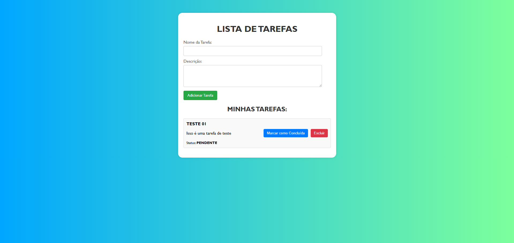
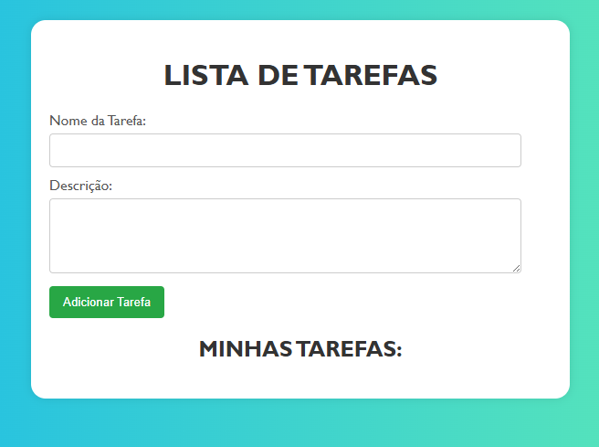
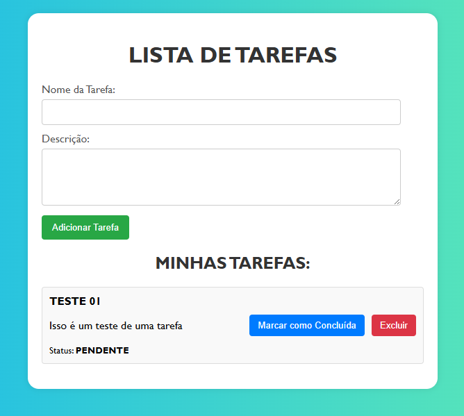

# 📋 CRUD de Tarefas (PHP + Docker)

Este projeto consiste em um sistema completo de gerenciamento de tarefas (To-Do List), desenvolvido utilizando **PHP 8.2** puro (sem frameworks) no backend e **HTML/CSS/JS** vanilla no frontend.

O objetivo principal é demonstrar a implementação de uma **API RESTful** seguindo o padrão MVC (Model-View-Controller), conteinerização com **Docker** e interação assíncrona com o frontend.

---

## 🖼️ Telas do Projeto

| Tela Inicial | Adicionando Tarefa |
|:---:|:---:|
| |  |
| Tela Inicial(ZOOM) | Adicionando Tarefa |
| |  |

---

## 🚀 Tecnologias Utilizadas

### Backend
* **PHP 8.2**: Linguagem principal.
* **PDO**: Para conexão segura com o banco de dados.
* **Apache**: Servidor web.
* **Arquitetura MVC**: Separação de responsabilidades.

### Frontend
* **HTML5 & CSS3**: Estrutura e estilização responsiva.
* **JavaScript (ES6+)**: Consumo da API via `fetch` e manipulação do DOM.

### Infraestrutura & Dados
* **Docker & Docker Compose**: Orquestração dos containers.
* **MySQL 8.0**: Banco de dados relacional.
* **phpMyAdmin**: Interface web para gerenciamento do banco.

---

## 📂 Estrutura do Projeto

O projeto está organizado em serviços separados (Frontend e Backend):

```bash
/
├── backend/                  # API REST em PHP
│   ├── config/               # Configuração de conexão com o Banco
│   ├── controllers/          # Lógica de controle (CT_Tarefas)
│   ├── models/               # Regras de negócio e SQL (MD_Tarefas)
│   ├── routes/               # Roteamento das requisições
│   ├── index.php             # Ponto de entrada (Entrypoint)
│   ├── .htaccess             # Redirecionamento de rotas Apache
│   └── Dockerfile            # Configuração da imagem PHP
│
├── frontend/                 # Aplicação Cliente
│   ├── index.html            # Interface do usuário
│   ├── script.js             # Lógica JS e chamadas à API
│   └── style.css             # Estilos
│
├── docker-compose.yml        # Orquestração dos containers
└── README.md                 # Documentação do projeto
```
## 🔧 Como Executar o Projeto

Para replicar este ambiente na sua máquina, precisará de ter o **Docker** e o **Docker Compose** instalados.

### Passo 1: Clonar o Repositório

```bash
git clone [https://github.com/seu-usuario/crud_tarefas_php.git](https://github.com/seu-usuario/crud_tarefas_php.git)
cd crud_tarefas_php
```

### Passo 2: Subir os Conteiners

```bash
docker-compose up -d --build
```
Isto irá iniciar os servidores nas seguintes portas: 
- Frontend: http://localhost:3000
- Backend (API): http://localhost:8000
- phpMyAdmin: http://localhost:8080
- MySQL: Porta 3306

### Passo 3: Configurar o DB(Banco de Dados)
A base de dados todo_db é criada automaticamente, mas é necessário criar a tabela de tarefas manualmente.
#### 1 Acesse o phpMyAdmin em: http://localhost:8080
 - Servidor: db
 - User: root
 - Senha: root

#### 2 Selecione a base de dados todo_db na barra lateral esquerda.
#### 3 Vá ao separador SQL e execute o seguinte comando:
```bash
CREATE TABLE IF NOT EXISTS tarefas (
  id INT UNSIGNED NOT NULL AUTO_INCREMENT,
  titulo VARCHAR(255) NOT NULL,
  descricao TEXT,
  status ENUM('pendente','concluida') NOT NULL DEFAULT 'pendente',
  created_at DATETIME NOT NULL DEFAULT CURRENT_TIMESTAMP,
  updated_at DATETIME NOT NULL DEFAULT CURRENT_TIMESTAMP ON UPDATE CURRENT_TIMESTAMP,
  PRIMARY KEY (id)
) ENGINE=InnoDB DEFAULT CHARSET=utf8mb4 COLLATE=utf8mb4_unicode_ci;
```
#### 4 Acessar à Aplicação
- 👉 Frontend: http://localhost:3000

## 👨‍💻 Autor
 ### Desenvolvido por Guilherme Reis.